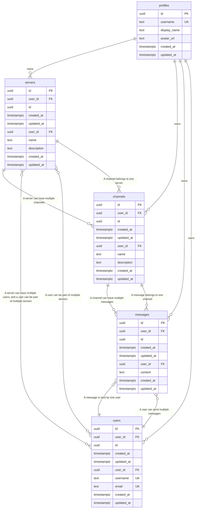

# Entity Relationship Diagram - FilmForge

> **Auto-generated** from your idea analysis
> **Entities:** 4

---

## Visual Diagram

---

## Entity Details

### Server
> A community server for discussing movies

**Fields:**
  - `id`: uuid (required) - Primary key
  - `created_at`: datetime (required) - Creation timestamp
  - `updated_at`: datetime (required) - Last update timestamp
  - `user_id`: uuid (required) - Owner user ID
  - `name`: string (required) - Server name
  - `description`: text - Server description

**Relationships:**
  - one_to_many → **Channel**: A server can have multiple channels
  - many_to_many → **User**: A server can have multiple users, and a user can be part of multiple servers

### Channel
> A discussion channel within a server

**Fields:**
  - `id`: uuid (required) - Primary key
  - `created_at`: datetime (required) - Creation timestamp
  - `updated_at`: datetime (required) - Last update timestamp
  - `user_id`: uuid (required) - Owner user ID
  - `name`: string (required) - Channel name
  - `description`: text - Channel description

**Relationships:**
  - one_to_many → **Message**: A channel can have multiple messages
  - many_to_one → **Server**: A channel belongs to one server

### Message
> A discussion message within a channel

**Fields:**
  - `id`: uuid (required) - Primary key
  - `created_at`: datetime (required) - Creation timestamp
  - `updated_at`: datetime (required) - Last update timestamp
  - `user_id`: uuid (required) - Owner user ID
  - `content`: text (required) - Message content

**Relationships:**
  - many_to_one → **Channel**: A message belongs to one channel
  - many_to_one → **User**: A message is sent by one user

### User
> A platform user

**Fields:**
  - `id`: uuid (required) - Primary key
  - `created_at`: datetime (required) - Creation timestamp
  - `updated_at`: datetime (required) - Last update timestamp
  - `user_id`: uuid (required) - Owner user ID
  - `username`: string (required, unique, indexed) - User username
  - `email`: string (required, unique, indexed) - User email

**Relationships:**
  - many_to_many → **Server**: A user can be part of multiple servers
  - one_to_many → **Message**: A user can send multiple messages

---

## Notes

- All entities have standard fields: `id`, `user_id`, `created_at`, `updated_at`
- `PK` = Primary Key, `FK` = Foreign Key, `UK` = Unique Key
- Copy the Mermaid code block to visualize in any Mermaid-compatible tool
- Relationships: `||--o{` = one-to-many, `||--||` = one-to-one, `}o--o{` = many-to-many
